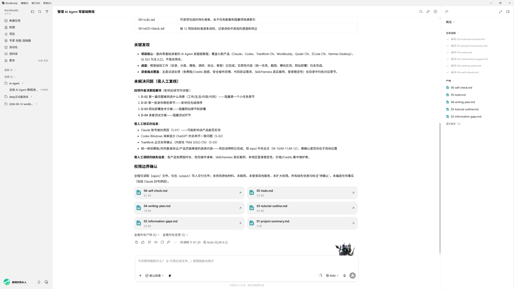
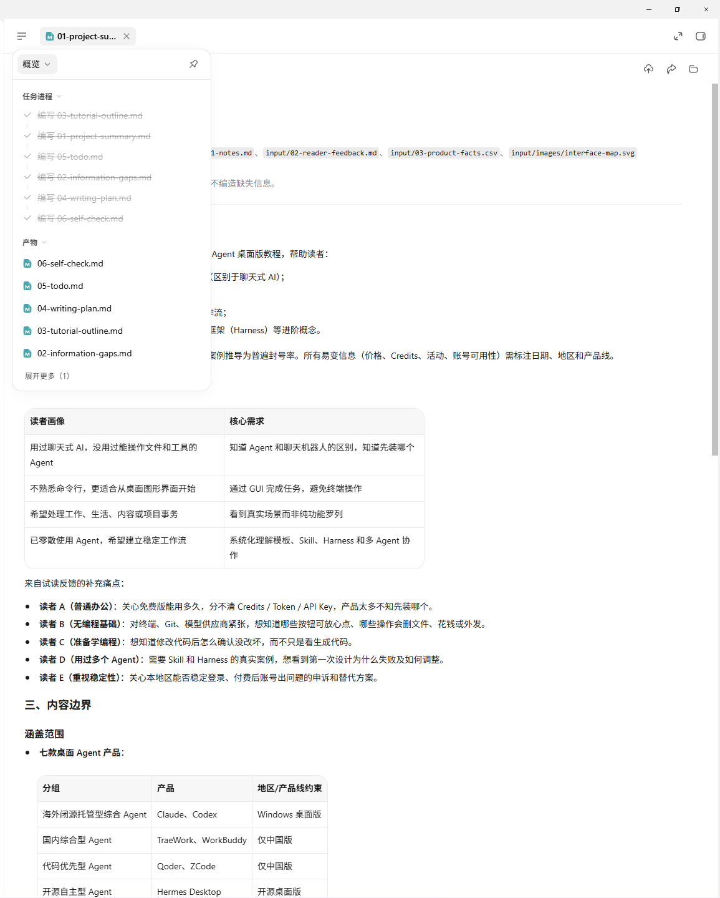
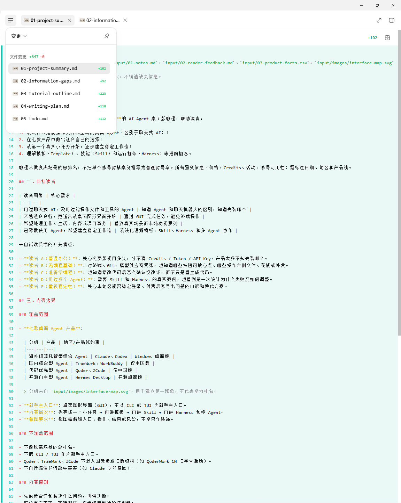

# WorkBuddy 界面讲解

> 截图所示版本：WorkBuddy v5.3.12（界面右上角显示；运行记录中曾记录 5.3.11，以最新界面为准）
>
> 截图日期：2026-08-12 之后补拍
>
> 讲解范围：统一基准任务（整理 AI Agent 教程材料）完成后的界面

## 1. 整体界面

整体采用「左侧导航 + 中间工作区 + 右侧信息栏」的三栏布局，底部是统一的 AI 对话输入框。中间区域展示当前任务的总结报告与产物文件卡片。

### 区域拆解

| 区域 | 内容与作用 |
|---|---|
| 顶部菜单栏 | `编辑 / 窗口 / 帮助` 等传统应用菜单，右上角显示版本号 WorkBuddy v5.3.12 |
| 左侧导航栏 | 主功能入口：新建任务、助理、项目、专家·技能·连接器、自动化、资料库、更多（应用·灵感）。这是进入各类能力的总入口 |
| 左侧项目区 | `任务 (1)`、`空间 (3)`：显示当前任务与空间，如「AI Agent」「deep正式版测试」「2026-08-12-workb...」，可切换工作空间 |
| 中间工作区 | 任务内容主体：本次展示「整理 AI Agent 零基础教程」任务的总结报告（关键发现、未解决问题等），下方是产物文件卡片（05-todo.md、06-self-check.md 等） |
| 底部输入框 | AI 对话输入区，支持 `@` 引用文件、`/` 调用技能，并可选工作空间与权限 |
| 右侧信息栏 | 概览、产物、引用来源等任务相关信息（在概览详情图中可见） |

## 2. 概览与产物

概览页集中展示任务进程与产物，右侧为文档正文（Markdown 渲染）。

### 区域拆解

| 区域 | 内容与作用 |
|---|---|
| 任务进程 | 列出本轮完成的工作项：编写 03-tutorial-outline.md、01-project-summary.md、05-todo.md、02-information-gaps.md、04-writing-plan.md、06-self-check.md |
| 产物列表 | 本轮交付文件：06-self-check.md、05-todo.md、04-writing-plan.md、03-tutorial-outline.md、02-information-gaps.md 等，可点击打开预览 |
| 文档正文 | 所选产物的 Markdown 渲染效果（项目目标、读者画像表格、内容边界等），证明成品可直接阅读 |

## 3. 变更与 diff

变更面板展示本轮所有文件改动及行级 diff，是核对「Agent 到底改了什么」的关键环节。

### 区域拆解

| 区域 | 内容与作用 |
|---|---|
| 变更面板（左侧悬浮） | 标题「变更」，统计 `文件变更 +647 -0`；逐文件列出：01-project-summary.md +102、02-information-gaps.md +92、03-tutorial-outline.md +223、04-writing-plan.md +118、05-todo.md +112 |
| 文件差异区（中间） | 选中文件的 Markdown 源码与内容预览，可查看具体新增内容 |
| 变更数量提示 | 变更列表显示 5 份文件，而产物实际为 6 份（06-self-check.md 未出现在变更列表）——这是实测发现的展示遗漏，核对时需要注意 |

## 小结

- 界面形态：三栏式综合工作台，导航入口丰富（项目/专家/技能/连接器/自动化/资料库）；
- 交付展示能力：概览、产物列表、Markdown 预览、文件变更与逐文件 diff 齐全；
- 特点：成品预览在客户端内直接渲染，变更统计（+647/-0）一目了然；但产物列表与变更列表数量不一致，说明「交付清单」与「变更视图」是两套口径，核对时都需查看。
