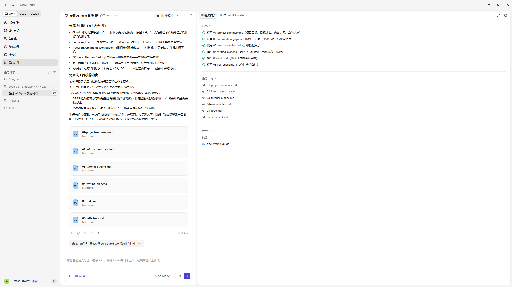
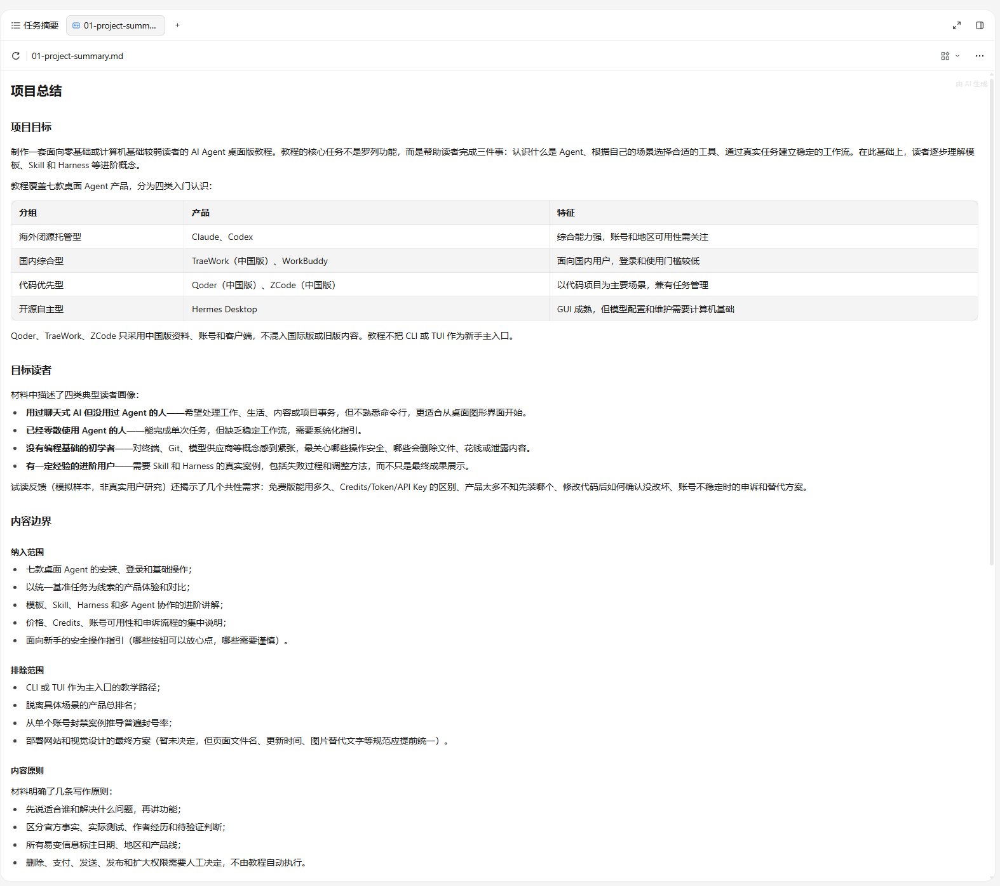

# TraeWork 中国版 界面讲解

> 截图所示版本：TraeWork CN（0.1.47 运行记录，以界面为准）
>
> 截图日期：2026-08-12 之后补拍
>
> 讲解范围：统一基准任务（整理 AI Agent 教程材料）完成后的界面

## 1. 整体界面

整体为三栏布局，顶部提供 `Work / Code / Design` 三种模式切换，是本产品最核心的结构特征。中间是任务对话与结果展示，右侧是任务摘要与产物清单。

### 区域拆解

| 区域 | 内容与作用 |
|---|---|
| 顶部模式栏 | `Work / Code / Design` 三种模式入口——Work 偏综合办公，Code 偏开发，Design 偏设计；本任务运行在 Work 模式 |
| 左侧导航栏 | 新建任务、插件市场、自动化、办公助理、模板库、我的文件、任务列表；下方是当前项目（AI Agent / 2026-08-12-traework-cn-v0.1.47） |
| 中间工作区 | 任务对话与结果：本次展示「整理 AI Agent 教程材料」任务的「未解决问题」清单（Claude 封号原因、Codex 与 ChatGPT 身份关系、Credits 规则待核实等），Agent 以卡片形式呈现结论 |
| 右侧信息栏 | 任务摘要与产物清单，展示本轮交付概览 |

## 2. 概览预览

概览页将任务摘要与产物预览放在一起：左侧是任务摘要，右侧是 `01-project-summary.md` 的完整渲染结果。

### 区域拆解

| 区域 | 内容与作用 |
|---|---|
| 任务摘要 | 当前任务的完成状态摘要，与产物文件关联 |
| 产物预览 | `01-project-summary.md` 的 Markdown 渲染：项目目标、目标读者、四类产品分组表（海外闭源托管型 / 国内综合型 / 代码优先型 / 开源自主型）、中国版范围说明等 |
| 文件页签 | 顶部文件列表（01-project-summ...），可切换到其他产物查看 |

## 功能范围说明

- **概览/预览**：✅ 有。任务摘要 + Markdown 成品预览渲染完整；
- **变更/差异/审阅**：本轮未留存相关截图。界面中未见与 WorkBuddy 类似的「文件变更 +diff」面板入口；在运行记录中也未单独记录变更视图，因此**暂不能确认其变更展示能力的完整范围**，如实标注为「未验证」；
- 补充：TraeWork 的实际模型在本次运行中未记录，界面也未显示所用模型。

## 小结

- 界面形态：三模式（Work/Code/Design）综合工作台，办公能力入口（插件市场、自动化、办公助理、模板库）齐全；
- 交付展示能力：概览与成品预览完整；变更/审阅环节未验证；
- 特点：模式切换是其最大辨识点，新手可按任务类型选入口；产物预览直接渲染 Markdown，阅读体验接近文档站点。
