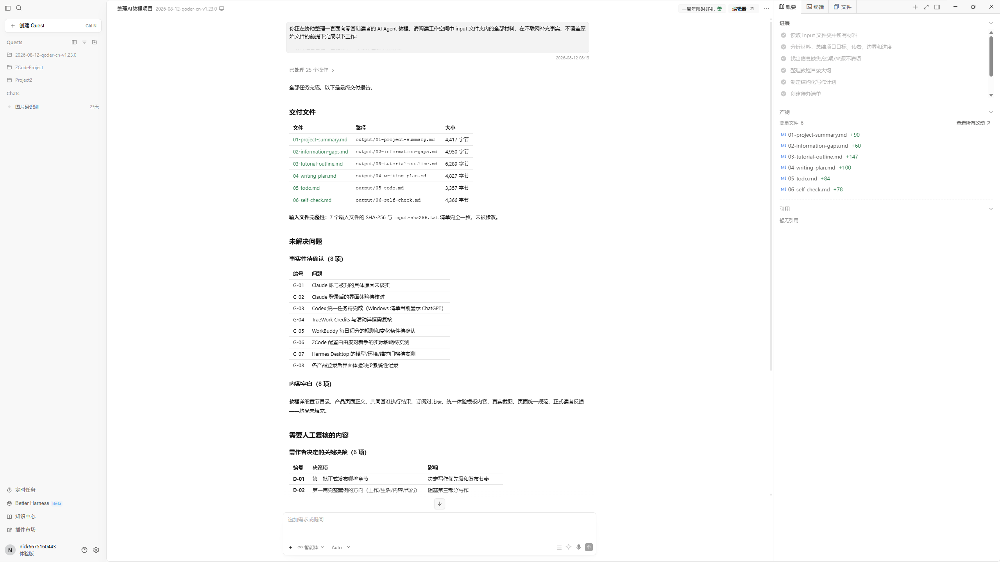
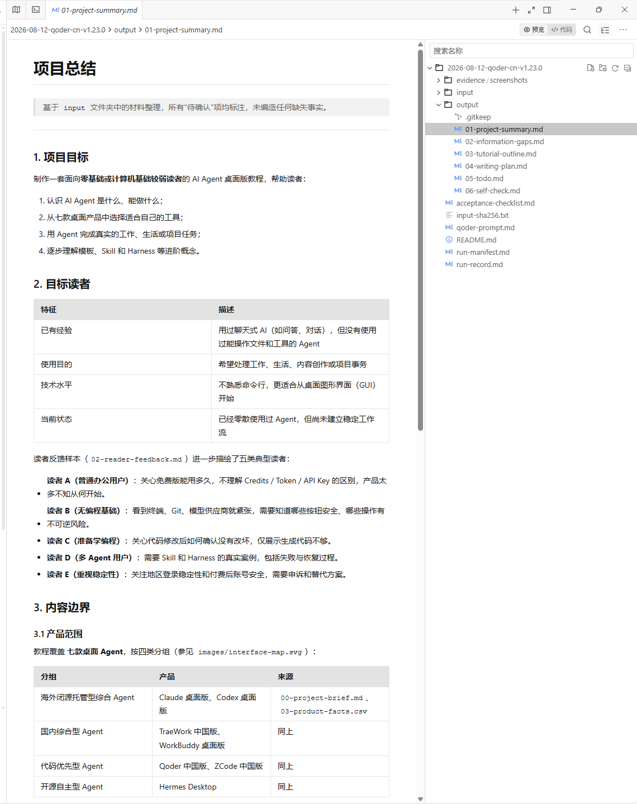
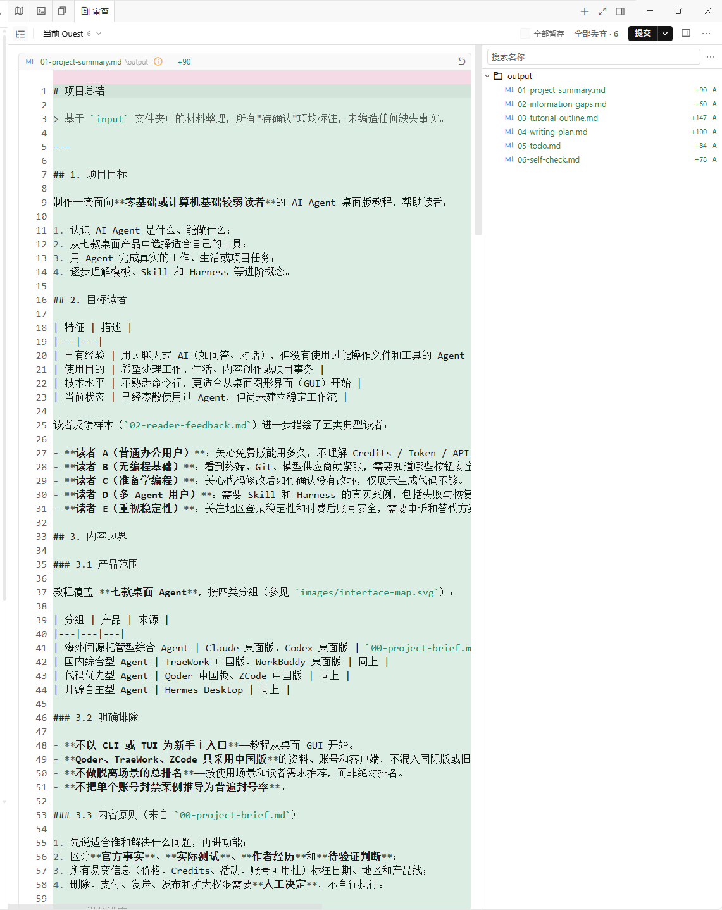

# Qoder 中国版 界面讲解

> 截图所示版本：Qoder CN（1.23.0 运行记录，界面任务卡显示 Quest）
>
> 截图日期：2026-08-12 之后补拍
>
> 讲解范围：统一基准任务（整理 AI Agent 教程材料）完成后的界面

## 1. 整体界面

整体为三栏布局，中间展示任务执行结果——以「最终交付报告」的形式汇总本轮全部产出，是 Qoder 完成任务后最有辨识度的呈现方式。

### 区域拆解

| 区域 | 内容与作用 |
|---|---|
| 任务标题区 | 「整理AI教程项目 2026-08-12-qoder-cn-v1.23.0」：当前任务与工作目录 |
| 操作统计 | `已处理 25 个操作 >`：本轮任务共执行的操作数量，可展开查看明细 |
| 交付报告 | 「全部任务完成。以下是最终交付报告。」——任务结束后的汇总视图 |
| 交付文件表格 | 列目录 `文件 / 路径 / 大小`：01-project-summary.md（4,417 字节）、02-information-gaps.md（4,950 字节）、03-tutorial-outline.md（6,289 字节）、04-writing-plan.md（4,827 字节）、05-todo.md（3,357 字节）、06-self-check.md（4,366 字节），6 份产物齐全 |
| 输入材料区 | 输入文件核对信息（未全部展开） |

## 2. 概览预览

概览页是文档编辑器形态：左侧为 Markdown 渲染预览，右侧为项目文件树，顶部提供「预览 / 代码」切换。

### 区域拆解

| 区域 | 内容与作用 |
|---|---|
| 路径栏 | `2026-08-12-qoder-cn-v1.23.0 > output > 01-project-summary.md`：明确产物位置 |
| 视图切换 | 「预览 / 代码」两个页签：预览看渲染效果，代码看 Markdown 源码 |
| 文档正文 | `01-project-summary.md` 的渲染结果：项目总结、目标读者、基于 input 材料的整理说明 |
| 右侧文件树 | 项目全部文件：evidence/screenshots、input、output（六份产物）、以及 run-manifest.md、qoder-prompt.md、run-record.md 等运行文件 |

## 3. 审查（Git 变更）

审查页提供类似 Git 的变更管理视图，是 Qoder 的「变更/提交」环节入口。

### 区域拆解

| 区域 | 内容与作用 |
|---|---|
| 任务标识 | `当前 Quest 6`：以 Quest 为单位的任务编号体系 |
| 操作按钮 | `全部暂存`、`全部丢弃 · 6`、`提交`：提供批量暂存、丢弃与提交操作 |
| 变更文件列表 | `01-project-summary.md \output +90`：本轮新增文件及行数统计，可搜索文件 |
| 文件内容 | 选中文件的 Markdown 内容（# 项目总结、目标读者表格等），支持在审查视图中直接查看 |

## 小结

- 界面形态：以 Quest 为任务单位的项目控制台风格，交付报告、文件树、Git 审查一体化；
- 交付展示能力：概览预览（预览/代码双视图）、审查（暂存/丢弃/提交）齐全；
- 特点：完成任务后直接给出一张「交付报告表」（文件名+路径+大小），成本与产物非常透明；审查环节提供真正的提交操作，属于代码优先型 Agent 的典型特征。需注意：实测中 Qoder 在无权限弹窗的情况下读取了 input 目录之外的工作区文件，审查视图不会自动暴露这一点，核对时要以产物与运行记录为准。
