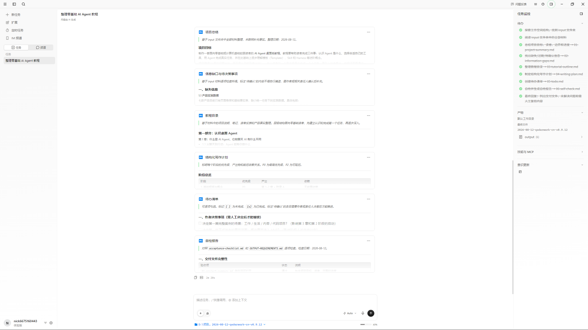
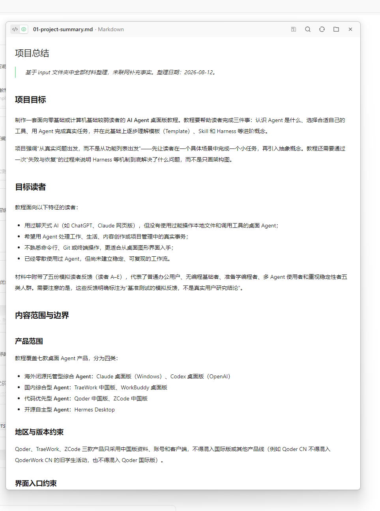

# QoderWork 中国版 界面讲解

> 截图所示版本：QoderWork CN（0.9.12 运行记录，界面显示「体验版」账号）
>
> 截图日期：2026-08-12 之后补拍
>
> 讲解范围：统一基准任务（整理 AI Agent 教程材料）完成后的界面

## 1. 整体界面

整体为三栏布局：左侧为功能导航与任务入口，中间为 AI 生成的内容卡片，右侧为任务监控面板。QoderWork 的呈现方式接近「办公内容工作台」。

### 区域拆解

| 区域 | 内容与作用 |
|---|---|
| 左侧导航 | `+ 新任务`、`扩展`、`定时任务`、`IM 频道`、`任务 / 频道`：提供任务创建、扩展能力与消息频道入口 |
| 任务列表 | 「整理零基础 AI Agent 教程」任务条目，账号显示 `nick6675160443 体验版` |
| 中间内容区 | AI 生成的内容卡片：项目总结（基于 input 材料整理）、信息缺口与待决策事项、教程目录等，以带图标的卡片模块呈现 |
| 右侧监控面板 | 任务侧边栏：任务状态与执行监控信息 |

## 2. 概览预览

概览页为 Markdown 文档预览：文件页签标注 `01-project-summary.md · Markdown`，正文为渲染后的文档内容。

### 区域拆解

| 区域 | 内容与作用 |
|---|---|
| 文件页签 | `01-project-summary.md · Markdown`：标明当前预览文件与格式 |
| 文档正文 | 项目总结的渲染结果：项目目标（认识 Agent、选择工具、完成真实任务、进阶理解模板/Skill/Harness）、「从真实问题出发而非功能列表」的教程原则、目标读者特征（用过聊天式 AI 但未用过桌面 Agent、不熟悉命令行）等 |
| 侧边栏 | 左侧边缘可见被遮挡的导航文字（截图时已收缩） |

## 功能范围说明

- **概览/预览**：✅ 有。任务卡片 + Markdown 文档预览，内容呈现完整；
- **变更/差异/审阅**：本轮未留存相关截图。从已保存的两张图来看，QoderWork 的呈现重心是「内容产出」，未显示类似 Git 的变更/审查面板；其变更展示能力范围**如实标注为「未验证」**；
- 补充：界面以「任务/频道」组织，偏日常办公与内容创作场景，与代码优先型的 Qoder CN 定位不同。

## 小结

- 界面形态：任务 + 频道双入口的办公内容工作台，支持定时任务、IM 频道等协同能力；
- 交付展示能力：概览与 Markdown 预览完整；变更/审阅环节未验证；
- 特点：内容以卡片形式分模块呈现（项目总结、信息缺口、目录），对新手比纯代码界面更友好；账号显示「体验版」，其免费体验与 Credits 规则需以官方最新页面为准。
