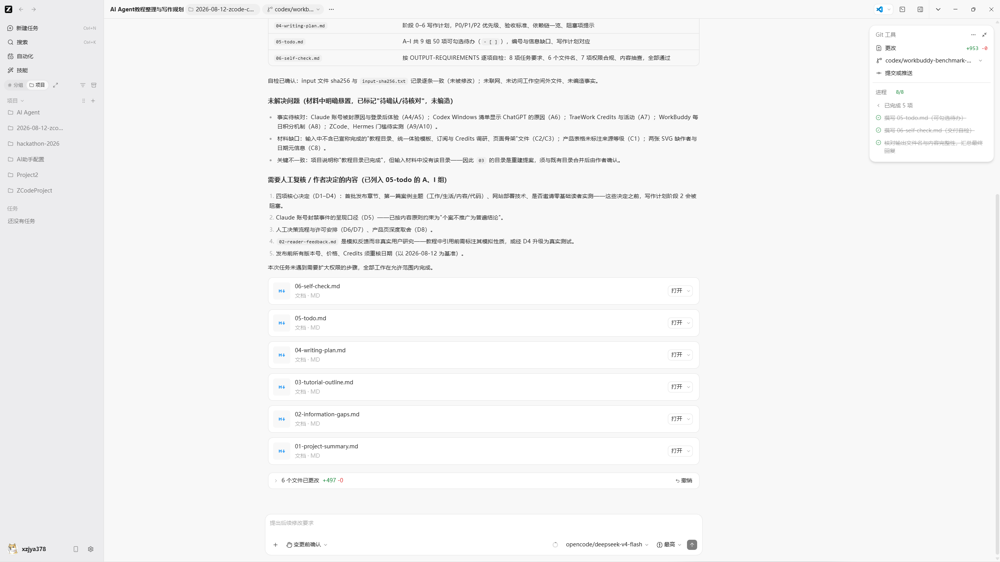
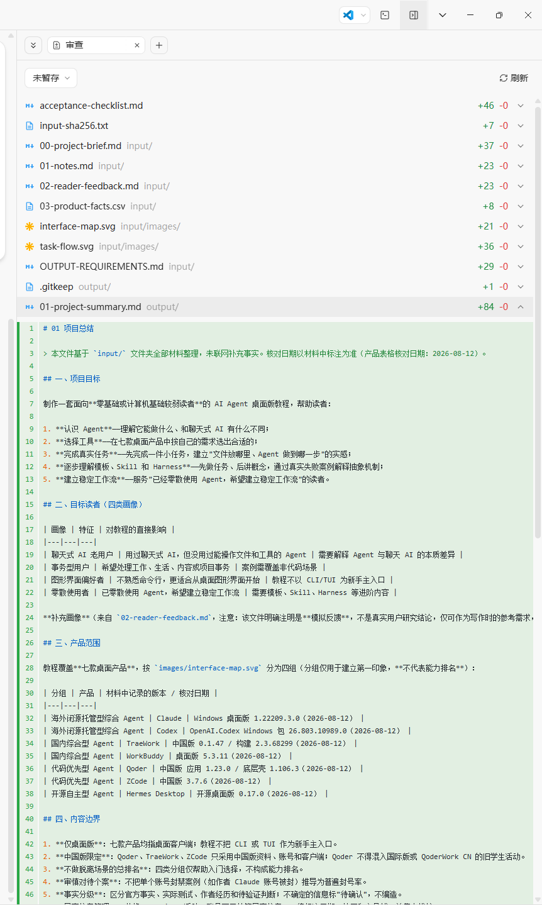

# ZCode 中国版 界面讲解

> 截图所示版本：ZCode（3.7.6 运行记录，以界面为准）
>
> 截图日期：2026-08-12 之后补拍
>
> 讲解范围：统一基准任务（整理 AI Agent 教程材料）完成后的界面

## 1. 整体界面

整体为典型 IDE 布局：左侧项目文件树，中间任务汇报与文档内容，右侧 Git 工具面板。任务完成后，中间区域直接展示总结性的「任务汇报」。

### 区域拆解

| 区域 | 内容与作用 |
|---|---|
| 左侧文件树 | 项目文件导航：`AI Agent教程整理与写作规划`、`2026-08-12-zcode-c...`、分支 `codex/workb...` |
| 中间汇报区 | 本轮交付说明：04-writing-plan.md（P0/P1/P2 优先级与依赖链）、05-todo.md（A-I 共 9 组 50 项可勾选待办）、06-self-check.md（按 OUTPUT-REQUIREMENTS 逐项自检、输入 SHA-256 一致、未访问工作空间外文件） |
| 未解决问题区 | 事实待核对清单（Claude 封号原因、Codex 与 ChatGPT 身份关系、TraeWork Credits、WorkBuddy 每日积分、ZCode/Hermes 门槛待实测）与材料缺口说明 |
| 右侧 Git 面板 | Git 工具悬浮面板：提交记录与仓库状态（与左侧文件树并列） |

## 2. 审查（Git 变更）

审查页是 Git 源代码管理视图：上半部分为完整变更清单，下半部分为选中文件的内容预览。

### 区域拆解

| 区域 | 内容与作用 |
|---|---|
| 状态区 | `审查` 视图、`未暂存` 状态、`刷新` 按钮 |
| 变更清单 | 逐文件列出增删行数：acceptance-checklist.md +46 -0、input-sha256.txt +7 -0、input/ 下 00-project-brief.md +37、01-notes.md +23、02-reader-feedback.md +23、03-product-facts.csv +8、interface-map.svg +21、task-flow.svg +36、OUTPUT-REQUIREMENTS.md +29、output/.gitkeep +1、01-project-summary.md +84 -0 |
| 内容预览 | 选中文件 `01-project-summary.md` 的行级内容（# 01 项目总结、基于 input 文件夹全部材料整理），与变更清单联动 |

## 功能范围说明

- **概览/预览**：✅ 有。整体界面中间即任务汇报与产物说明，未单独留存独立预览图，但交付内容以 Markdown 文档形式展示；
- **变更/审阅**：✅ 有。审查视图提供完整 Git 变更清单（文件+路径+增删行数）与内容预览，能力完整；
- 补充：ZCode 本轮使用 BYOK（OpenCode Go + DeepSeek V4 Flash、最高推理强度、变更前确认权限），运行中出现过写入权限确认与人工回复，其审查视图能清楚呈现最终变更范围。

## 小结

- 界面形态：任务管理与 Git 深度整合的编程 Agent，文件树 + 汇报 + Git 面板三区联动；
- 交付展示能力：任务汇报、Git 变更清单（含逐文件增删统计）、内容预览齐全；
- 特点：变更透明性最强——每一份输入、输出、验收文件的增删行数都可逐项核对；但整体配置门槛较高（需自行选择模型渠道与推理强度），适合有一定基础的读者。
