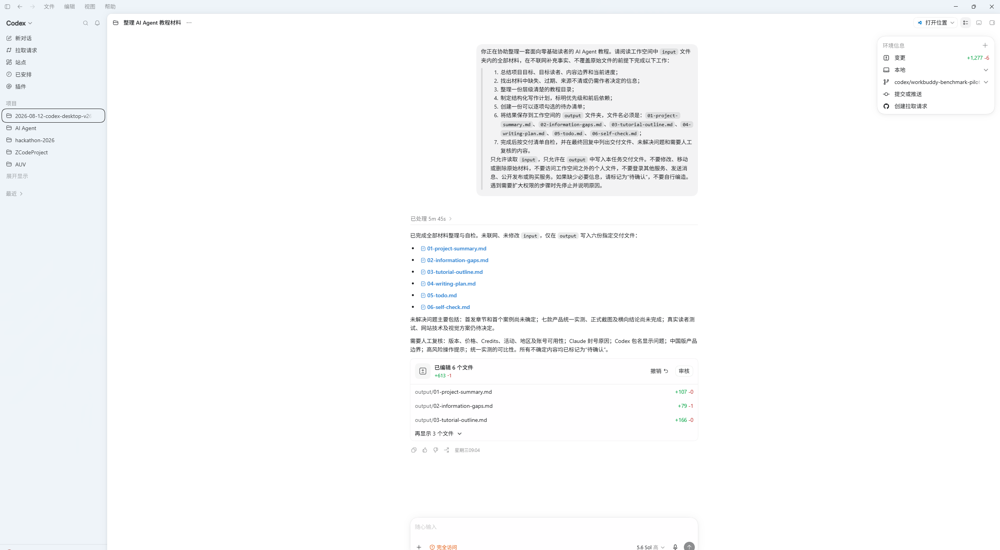
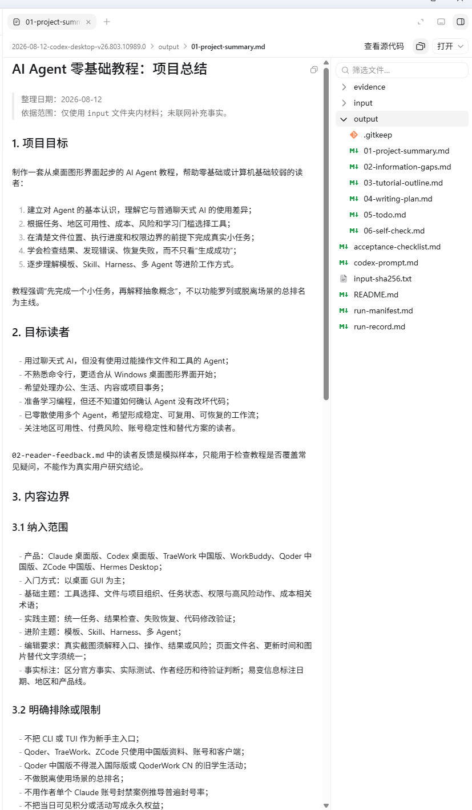
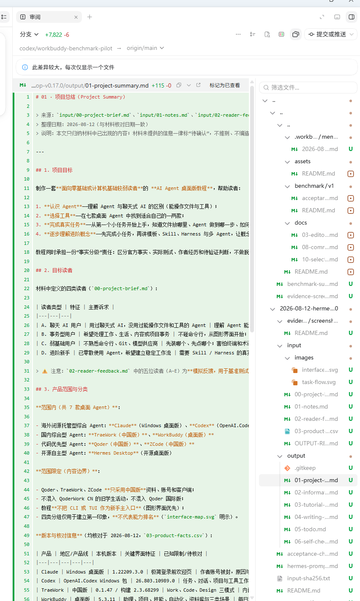

# Codex Desktop 界面讲解

> 截图所示版本：Codex 桌面包（26.803.10989.0 运行记录；Windows 清单与窗口标题当前显示 ChatGPT，安装包名为 OpenAI.Codex）
>
> 截图日期：2026-08-12 之后补拍
>
> 讲解范围：统一基准任务（整理 AI Agent 教程材料）完成后的界面

## 1. 整体界面

整体为三栏布局：左侧为导航与项目列表，中间为任务对话区（提示词 + AI 回复 + 文件变更详情），右侧为环境信息面板。Codex 以「任务」为核心组织工作区。

### 区域拆解

| 区域 | 内容与作用 |
|---|---|
| 左侧导航 | `新对话`、`拉取请求`、`站点`、`已安排`、`插件`：任务、PR、站点部署、定时任务与插件入口 |
| 项目列表 | `项目` 下方：2026-08-12-codex-desktop-v26、AI Agent、hackathon-2026、ZCodeProject、AUV；`最近` 显示当前对话「整理 AI Agent 教程材料 ...」与「打开位置」 |
| 中间对话区 | 任务对话流：统一提示词原文、AI 执行过程、文件变更与交付结果；「展开显示」可展开完整内容 |
| 右侧面板 | 环境信息（工作空间/上下文相关，截图已收缩） |

## 2. 概览预览

概览页为文档查看形态：左侧为 Markdown 成品预览，右侧为文件列表，顶部有「查看源代码 / 打开」操作。

### 区域拆解

| 区域 | 内容与作用 |
|---|---|
| 路径栏 | `2026-08-12-codex-desktop-v26.803.10989.0 > output > 01-project-summary.md`：产物位置明确 |
| 操作按钮 | `查看源代码`、`打开`：可在渲染视图与源码间切换、或直接打开文件 |
| 文档正文 | `01-project-summary.md` 渲染结果：项目目标（认识 Agent 与聊天式 AI 的差异、按任务/地区/成本/风险选型、完成真实小任务、学会检查结果与恢复失败、理解模板/Skill/Harness）、教程原则（先完成小任务再解释抽象概念） |
| 右侧文件列表 | output 目录下的产物文件（01-project-summary... 等） |

## 3. 审阅（diff）

审阅页是 Codex 的变更差异视图：显示分支状态、变更规模与逐文件 diff。

### 区域拆解

| 区域 | 内容与作用 |
|---|---|
| 审阅入口 | 页面标题「审阅」，与概览、对话并列 |
| 分支与规模 | 分支 `codex/workbuddy-benchmark-pilot - origin/main`，变更统计 `+7,822 -6` |
| 提交操作 | `提交或推送` 按钮：变更确认后可直接提交推送 |
| 文件差异 | 「此差异较大，每次仅显示一个文件」提示；文件 `...op-v0.17.0/output/01-project-summary.md +115 -0`（注：截图对应 Hermes 运行目录的文件，说明审阅视图可按仓库全局查看）；`标记为已查看`、`筛选文件...` 操作 |
| Diff 内容 | 左侧为绿色新增行（01. 项目总结全文），逐行展示新增内容 |

## 小结

- 界面形态：任务驱动的桌面工作台，对话、项目、Git、部署一体化；
- 交付展示能力：概览预览（渲染/源码切换）、审阅（分支+变更统计+逐文件 diff+提交推送）齐全；
- 特点：审阅视图与 Git 深度整合，变更规模（+7,822 -6）与分支对比一目了然，适合核对 Agent 对仓库的整体改动；本轮成本在客户端不透明，费用需另查账单。注意截图标题为 ChatGPT 是当前桌面包的窗口标题，与安装包名 OpenAI.Codex 并存。
