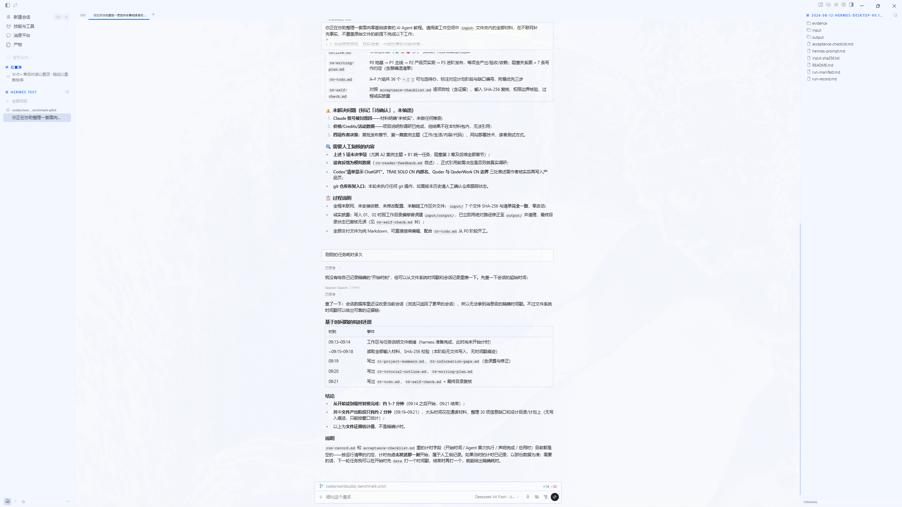
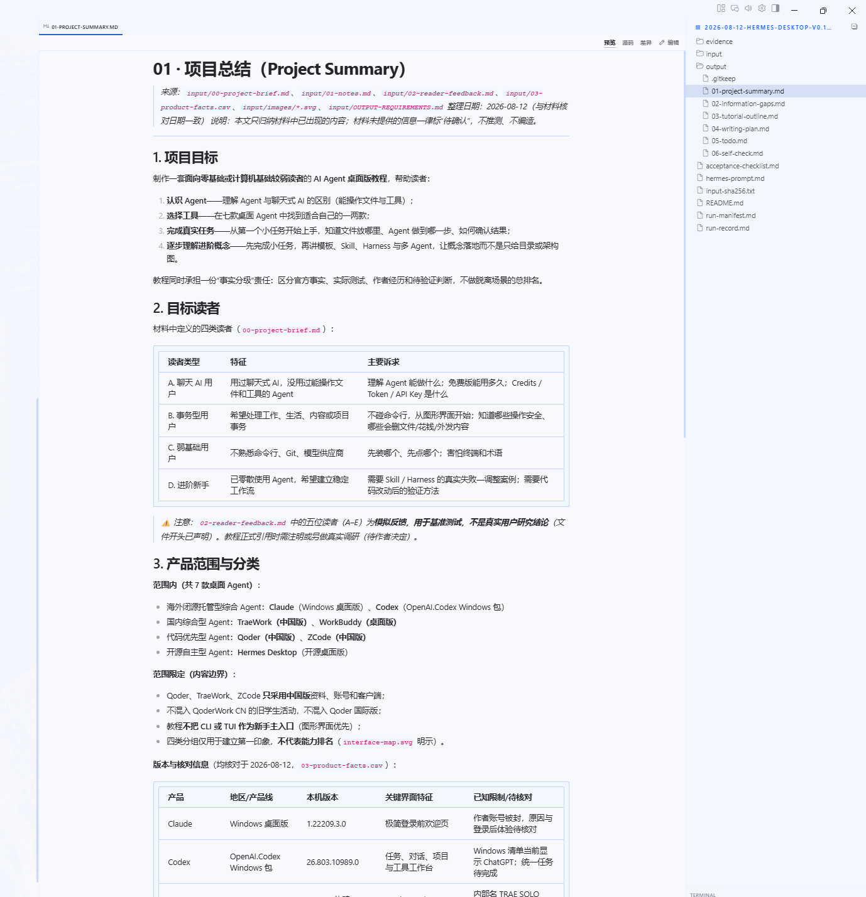
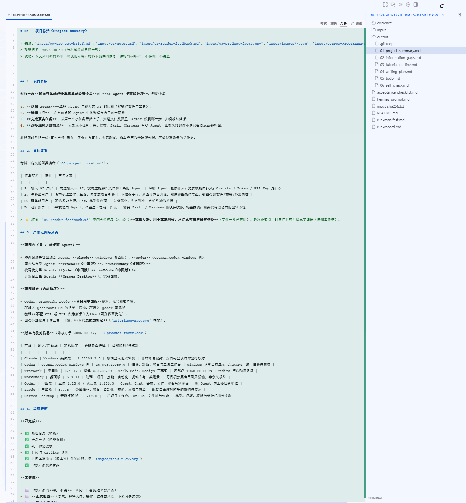

# Hermes Desktop 界面讲解

> 截图所示版本：Hermes Desktop（0.17.0 运行记录，以界面为准）
>
> 截图日期：2026-08-12 之后补拍
>
> 讲解范围：统一基准任务（整理 AI Agent 教程材料）完成后的界面

## 1. 整体界面

整体为三栏工作台：左侧为会话与工具导航，中间为对话流（任务说明、问题清单、耗时分析表格与结论），右侧为文件资源管理器。布局接近成熟 IDE，属于「配置门槛高、但 GUI 本身成熟」的产品。

### 区域拆解

| 区域 | 内容与作用 |
|---|---|
| 左侧导航 | `新建会话`、`技能与工具`、`消息平台`、`产物`、`搜索会话...`；项目 `HERMES TEST`、`全部项目`、当前分支 `codex/wor...enchmark-pilot`；「Shift + 单击对话以置顶，拖动以重新排序」为会话管理提示 |
| 中间对话区 | 任务对话流：统一提示词、交付说明（04-writing-plan.md 的 P0→P1→P2→P3 计划、05-todo.md 的 A-F 六组 36 项待办、06-self-check.md 对照验收清单自检并含 SHA-256 证据） |
| 右侧文件树 | 项目文件资源管理器（evidence、input、output 等） |

## 2. 预览

预览页为 Markdown 成品渲染：`01 · 项目总结` 文档全文渲染，右侧为项目文件树。

### 区域拆解

| 区域 | 内容与作用 |
|---|---|
| 文档标题 | `01 · 项目总结 (Project Summary)`，注明来源（input 全部材料）与整理日期 |
| 文档正文 | 项目目标、读者画像（零基础或计算机基础较弱）、教程承担「事实分级」责任（区分官方事实、实际测试、作者经历）等，渲染完整 |
| 右侧文件树 | 项目文件结构（evidence、input、output、运行文件） |

## 3. 差异（源码/差异多视图）

差异页展示文件的「预览 / 源码 / 差异 / 编辑」四种视图切换能力，当前显示 Markdown 源码。

### 区域拆解

| 区域 | 内容与作用 |
|---|---|
| 文件页签 | `01-PROJECT-SUMMARY.MD`：当前文件 |
| 视图切换 | `预览 / 源码 / 差异 / 编辑` 四个页签：可看渲染效果、Markdown 源码、与原始版本的差异，或直接编辑——这是 Hermes 区别于其他产品的多视图能力 |
| 项目文件树 | 右侧完整列出 evidence、input、output（六份产物 01-06）、acceptance-checklist.md、hermes-prompt.md、run-manifest.md 等 |

## 小结

- 界面形态：三栏式项目工作台，会话、工具、消息平台、产物、项目、Profiles 入口齐全；
- 交付展示能力：预览（Markdown 渲染）、差异（预览/源码/差异/编辑四视图）完整；
- 特点：视图切换最灵活，一个文件可同时看渲染、源码与差异；「极客属性」来自模型接入与配置自由，而非界面简陋。实测中 Hermes 曾把产物误写入 input/output 后自动恢复，教程中可借此说明「最终正确 ≠ 过程合规」，安全、恢复、透明度应分开评价。
